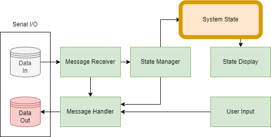

# pdevice-mngr

Project for portfolio demonstrating lightweight, multithreaded, c++ application for device status and management.

## Simulator

The simulator is an application that maintains the current state of the system. It also reads and writes to serial buffers shared with the manager. It parses the input buffer for commands from the manager, and writes commands-response messages to the output buffer to confirm their receipt. The simulator also has a seperate thread for reading and processing user input commands.

### Simulator Structure

The simulator launches five threads: a thread for managing the state of the system, a thread for displaying the state of the system based on the state of the system, a thread for reading from the input buffer, and a thread for writing to the output buffer, and a thread for reading and processing user input commands.

## Device - Manager

The manager is an application intended to run on a separate device with limited computational resources. It is responsible for managing the state changes of the system. It reads and writes to serial buffers shared with the simulator. It parses the input buffer for responses to its commands and for user-input messages. It writes commands to the output buffer to change the state of the system and its components.

### Manager Structure

The manager launches three threads: a thread for reading responses and user input commands from the serial buffer, a thread for writing commands to the serial buffer, a thread for forwarding parsed messages to other threads for each object being managed, and each of those threads.

